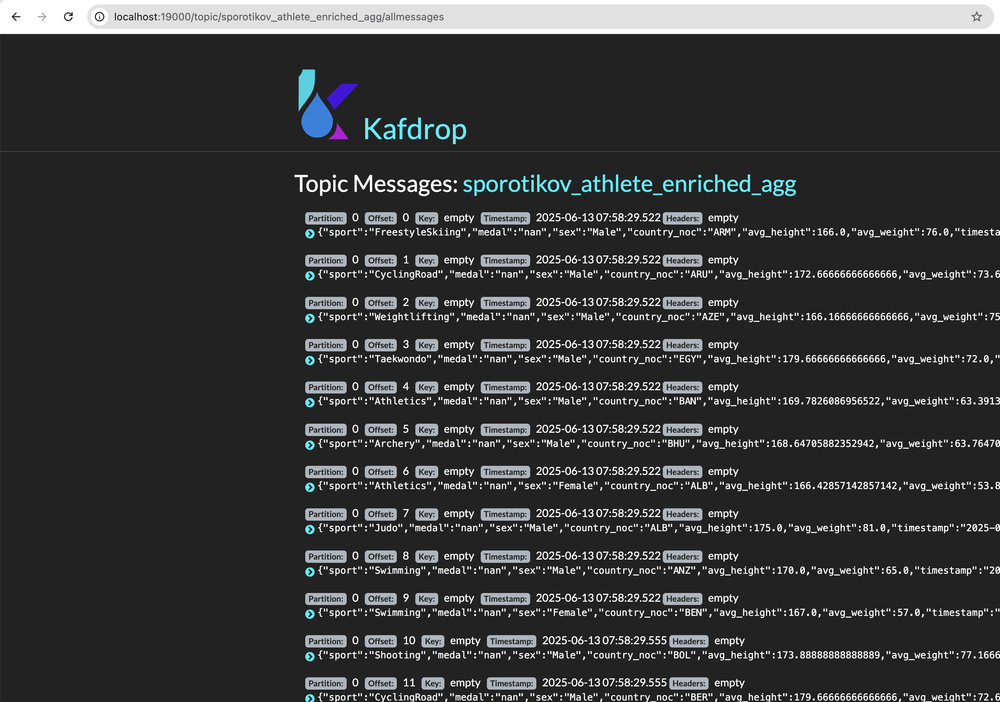

# Проєкт з побудови End-to-End Data Pipeline

Цей проєкт демонструє побудову двох типів конвеєрів даних:

1.  **Стримінговий пайплайн (Частина 1):** Обробляє дані в реальному часі. Імітує потік даних про спортивні події, обробляє їх за допомогою Spark Streaming, збагачує даними з іншої таблиці та записує агреговані результати в базу даних та інший топік Kafka.
2.  **Батчевий Data Lake (Частина 2):** Реалізує класичний ETL-процес з архітектурою Bronze/Silver/Gold, використовуючи FTP-сервер як джерело даних. Процес оркеструється за допомогою Apache Airflow.

## Структура проєкту

```
.
├── config/
│   └── config.ini
├── dags/
│   └── project_solution.py
├── db_init/
│   └── 01_schema.sql
├── screenshots/
├── scripts/
│   ├── migrate_data.py
│   ├── part1_streaming/
│   │   ├── producer.py
│   │   └── streaming_pipeline.py
│   └── part2_batch/
│       ├── landing_to_bronze.py
│       ├── bronze_to_silver.py
│       └── silver_to_gold.py
├── .env
├── docker-compose-airflow.yml
├── docker-compose.yml
├── Dockerfile.airflow
└── Dockerfile
```

## Перед початком роботи

1.  **Встановіть Docker та Docker Compose:** Переконайтеся, що на вашій системі встановлено [Docker](https://www.docker.com/get-started) та Docker Compose.
2.  **Створіть файл `.env`:** У корені проєкту створіть файл `.env` з таким вмістом. Це потрібно для коректного запуску Airflow.
    ```
    AIRFLOW_UID=50000
    ```
3.  **Перевірте конфігурацію:** Переконайтесь, що ваші файли оновлено до фінальних версій.

## Порядок роботи з проєктом

### Перший запуск (одноразове налаштування)

Ці кроки потрібно виконати **лише один раз**, щоб налаштувати середовище та завантажити дані.

**Крок 1: Побудова та запуск інфраструктури**

Ця команда побудує ваш кастомний образ Spark та запустить усі сервіси.

```bash
docker-compose up -d --build
```

*Зачекайте близько хвилини, поки всі контейнери стабілізуються.*

**Крок 2: Міграція даних**

Ця команда скопіює повний набір даних з віддаленої бази в локальну базу даних в Docker. Після цього кроку дані будуть зберігатися постійно.

```bash
docker-compose exec spark-master spark-submit \
  --packages mysql:mysql-connector-java:5.1.49 \
  --conf spark.jars.ivy=/tmp/.ivy2 \
  /opt/bitnami/spark/scripts/migrate_data.py
```

*Дочекайтеся повідомлення `Data migration completed successfully!`.*

### Подальша робота та отримання результатів

Після одноразового налаштування ви можете виконувати ці кроки для демонстрації та тестування.

**Крок 1: Запуск сервісів**

Якщо контейнери зупинені, запустіть їх командою:

```bash
docker-compose up -d
```

**Крок 2: Демонстрація Стримінгового пайплайну (Частина 1)**

1.  **Запустіть продюсер** (відправляє дані з локальної БД в Kafka):
    ```bash
    docker-compose exec spark-master spark-submit \
      --packages org.apache.spark:spark-sql-kafka-0-10_2.12:3.3.0,mysql:mysql-connector-java:5.1.49 \
      --conf spark.jars.ivy=/tmp/.ivy2 \
      /opt/bitnami/spark/scripts/part1_streaming/producer.py
    ```

2.  **Запустіть стрімінговий конвеєр** (обробляє дані з Kafka і записує результат):
      ```bash
        docker-compose exec spark-master spark-submit \
      --packages org.apache.spark:spark-sql-kafka-0-10_2.12:3.3.0,mysql:mysql-connector-java:5.1.49 \
      --conf spark.jars.ivy=/tmp/.ivy2 \
      /opt/bitnami/spark/scripts/part1_streaming/streaming_pipeline.py
      ```

**Отримання результатів для Частини 1:**

* **Результат в Kafka:** Перейдіть на `http://localhost:19000` (Kafdrop), знайдіть топік `sporotikov_athlete_event_results`
    
* **Результат в Kafka:** Перейдіть на `http://localhost:8080` (Adminer), знайдіть топік `sporotikov_athlete_enriched_agg`
    
* **Результат в MySQL:** Перейдіть на `http://localhost:8080` (Adminer), увійдіть у локальну базу даних (сервер: `mysql-db`) та перегляньте таблицю `sporotikov_athlete_enriched_agg`.
    

**Крок 3: Демонстрація Батчевого пайплайну (Частина 2)**

1.  **Запустіть Airflow:**
    ```bash
    docker-compose -f docker-compose-airflow.yml up -d
    ```

2.  * Відкрийте Airflow UI (`http://localhost:8082`), знайдіть та запустіть DAG `batch_datalake_pipeline_dag`.
    * Успішно виконаний граф.
        
    * Логи з виводом `df.show()` для кожного завдання.
        
        
        

## Очищення

* **Щоб просто зупинити контейнери, зберігши дані в базі:**
    ```bash
    docker-compose down
    docker-compose -f docker-compose-airflow.yml down
    ```

* **Щоб повністю видалити все (контейнери, мережі, дані в БД):**
    ```bash
    docker-compose down -v
    docker-compose -f docker-compose-airflow.yml down -v
    